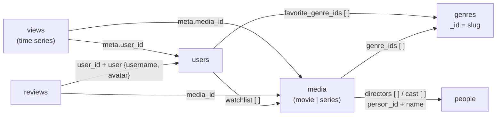

# Modelo de datos — Fotograma

El modelo se diseñó **a partir de las pantallas** (ver [`interfaces/`](interfaces/)): primero se definió qué muestra cada vista y después se armaron los documentos para que cada una se resuelva con la menor cantidad de consultas posible.

## Resumen

| Colección | Qué guarda | Volumen esperado | Crece… |
|---|---|---|---|
| `media` | Películas y series (un solo tipo de documento) | miles | poco |
| `genres` | Catálogo de géneros | ~10 | casi nunca |
| `people` | Actores y directores | miles | poco |
| `users` | Cuentas de usuario | miles | moderado |
| `reviews` | Reseñas de usuarios a títulos | cientos de miles | mucho |
| `views` | Sesiones de reproducción (**serie temporal**) | millones | muchísimo |



## Criterio general: ¿embeber o referenciar?

| Embebemos cuando… | Referenciamos cuando… |
|---|---|
| el dato **siempre se muestra junto** con el documento padre | el dato **se consulta por separado** o desde varios lados |
| la cantidad es **chica y acotada** (uno a pocos) | la cantidad **puede crecer sin límite** (uno a muchos) |
| el dato **pertenece solo** a ese documento | el dato **es compartido** por muchos documentos |

Cuando conviene un punto intermedio usamos **referencia extendida**: se guarda el `_id` y además una copia de los pocos campos que se muestran (por ejemplo, el nombre del actor dentro de la película).

---

## 1. `media`

Películas y series en una sola colección (**patrón polimórfico**): comparten casi todos los campos, y el campo `type` indica cuáles tiene cada uno.

```js
{
  _id: ObjectId("665f0a…10"),
  title: "El Eternauta",
  original_title: "…",                 // opcional
  type: "series",                      // "movie" | "series"
  release_year: 2025,
  plot: "Una noche, en Buenos Aires, empieza a caer una nevada…",
  poster: "posters/eternauta.jpg",
  backdrop: "backdrops/eternauta.jpg",
  genre_ids: ["ciencia-ficcion", "drama", "thriller"],   // → genres._id
  rating: { avg: 8.4, count: 3120 },   // calculado a partir de reviews
  is_featured: true,
  created_at: ISODate("2026-04-30T10:00:00Z"),           // alta en el catálogo

  // Las personas aparecen en DOS arrays distintos, según su rol:
  directors: [            // dirección (en series: creación). Puede haber más de uno
    { person_id: ObjectId("665f0b…25"), name: "Bruno Stagnaro" }
  ],
  cast: [                 // reparto principal
    { person_id: ObjectId("665f0b…10"), name: "Ricardo Darín", character: "Juan Salvo" },
    { person_id: ObjectId("665f0b…26"), name: "Carla Peterson", character: "Elena" }
  ],

  // solo si type = "movie"
  runtime_min: 148,

  // solo si type = "series"
  seasons: [
    { number: 1, year: 2025, episodes: [
        { number: 1, title: "Una noche de truco", runtime_min: 58 }, …
    ] }
  ]
}
```

**Decisiones**
- **Polimórfico:** el Inicio, la búsqueda y los géneros listan películas y series mezcladas. Con dos colecciones habría que consultar las dos y unir los resultados.
- **`genre_ids` guarda slugs** (`"ciencia-ficcion"`), no nombres. Se puede filtrar sin `$lookup`, y renombrar un género es modificar **un solo documento** en `genres`. Ver [§2](#2-genres).
- **`directors` y `cast`: arrays con referencia extendida.** El nombre se copia porque se muestra en cada detalle; el `person_id` permite ir a la ficha completa en `people`. Los dos son acotados: un reparto principal de ≈10 personas y uno o dos directores.
- **`directors` es un array y no un objeto** porque hay títulos con más de un director o creador (por ejemplo, Dark tiene dos creadores). Con un objeto habría que elegir uno solo o cambiar el esquema más adelante.
- **`seasons` embebido:** temporadas y episodios son pocos, solo se muestran dentro de su serie y no tienen sentido por separado (uno a pocos).
- **`rating` calculado (patrón computado):** se lee en cada card del catálogo, pero solo cambia cuando entra una reseña. Se recalcula al escribir una reseña en vez de promediar miles de reseñas en cada lectura.
- **Se quitó `weekly_view_count`** del modelo anterior: era un número inventado. Ahora las tendencias se calculan sobre `views`.

**Índices previstos**
| Índice | Para |
|---|---|
| `{ title: "text", original_title: "text" }` | barra de búsqueda |
| `{ genre_ids: 1, type: 1, "rating.avg": -1 }` | página de género y carruseles por género (multikey) |
| `{ type: 1, "rating.avg": -1 }` | "Series para maratonear", filtros Películas/Series |
| `{ created_at: -1 }` | "Recién agregadas" |
| `{ "cast.person_id": 1 }` · `{ "directors.person_id": 1 }` | filmografía de una persona (multikey) |
| `{ is_featured: 1 }` (parcial: `is_featured: true`) | hero del Inicio |

---

## 2. `genres`

```js
{ _id: "ciencia-ficcion", name: "Ciencia Ficción", color: "#4f7cff",
  description: "Futuros posibles, viajes en el tiempo y…" }
```

**Decisiones**
- Antes el género era un string repetido en cada película. Si había que corregir el nombre, había que modificar todos los títulos de ese género.
- El `_id` es un **slug estable**, que no cambia aunque cambie el nombre visible. Por eso puede vivir en `media.genre_ids` y en la URL (`genero.html?id=ciencia-ficcion`).
- Con un `ObjectId` puro, cada listado necesitaría un `$lookup` para mostrar el nombre. Con el slug no hace falta: la colección es tan chica que la aplicación la carga una vez.
- Renombrar es una sola operación: `db.genres.updateOne({ _id: "ciencia-ficcion" }, { $set: { name: "Sci-Fi" } })`.

---

## 3. `people`

```js
{
  _id: ObjectId("665f0b…10"),
  name: "Ricardo Darín",
  known_for: "Actuación",              // "Actuación" | "Dirección"
  birth_date: ISODate("1957-01-16T00:00:00Z"),
  country: "Argentina",
  bio: "Actor argentino, figura central del cine latinoamericano…",
  photo: "people/ricardo-darin.jpg"
}
```

**Decisiones**
- **Muchos a muchos** entre personas y títulos: una persona trabaja en muchos títulos y un título tiene muchas personas.
- La relación se guarda **de un solo lado** (en `media.directors` y `media.cast`). No hace falta mantener en `people` una lista de títulos: con índices multikey sobre `directors.person_id` y `cast.person_id`, la filmografía es un `find`:
  ```js
  db.media.find({ $or: [ { "cast.person_id": id }, { "directors.person_id": id } ] })
  ```
  Se usa `$or` porque una persona puede estar en el array `directors` o en el array `cast`, según su rol en cada título. Por ejemplo, Christopher Nolan aparece en `directors` y Ricardo Darín en `cast`. Cada array tiene su propio índice multikey.
- La biografía, la fecha y el país solo aparecen en la ficha de la persona, por eso no se copian en `media`.
- *Costo asumido:* si una persona cambia de nombre, hay que actualizar la copia en `media` con `updateMany`. Es un caso muy raro.

---

## 4. `users`

```js
{
  _id: ObjectId("665f0c…01"),
  username: "CineFan88",
  email: "cinefan@email.com",
  password_hash: "$2b$12$…",
  avatar: "avatars/cinefan88.jpg",
  birth_date: ISODate("1998-05-25T00:00:00Z"),
  country: "Argentina",
  created_at: ISODate("2024-01-15T18:30:00Z"),
  favorite_genre_ids: ["ciencia-ficcion", "drama", "thriller"],   // → genres._id

  subscription: { plan: "Premium", billing: "anual", renewal_date: ISODate("2027-01-15") },
  payment_methods: [
    { type: "card", brand: "Visa", last4: "4242", expiry: "08/28", is_default: true },
    { type: "mercadopago", email: "cinefan@email.com", is_default: false }
  ],

  watchlist: [ ObjectId("665f0a…06"), ObjectId("665f0a…13"), … ]   // → media._id
}
```

**Decisiones**
- `subscription` (uno a uno) y `payment_methods` (uno a pocos) se **embeben**: pertenecen solo a este usuario y se muestran en su perfil.
- `watchlist` guarda **solo referencias**. Si embebiera los títulos completos, el documento crecería mucho y habría datos duplicados que quedan desactualizados.
- **Se quitó `watched_list`:** lo que el usuario vio se obtiene de `views`, que además registra cuándo, cuánto tiempo y qué episodio. Es la misma información, pero sin un array que crece sin límite dentro del usuario.
- De la tarjeta solo se guarda `last4` (nunca el número completo), y `password_hash` nunca se envía al cliente (se excluye en la proyección).

**Índices previstos:** `{ email: 1 }` único, `{ username: 1 }` único.

---

## 5. `reviews`

```js
{
  _id: ObjectId("665f0d…01"),
  media_id: ObjectId("665f0a…10"),                       // → media
  user_id: ObjectId("665f0c…01"),                        // → users
  user: { username: "CineFan88", avatar: "avatars/cinefan88.jpg" },   // copia
  rating: 9,                                             // 1 a 10
  comment: "Por fin una producción argentina de este nivel…",
  created_at: ISODate("2026-05-04T22:10:00Z")
}
```

**Decisiones**
- **Colección propia** porque es **uno a muchos sin límite** desde dos lados: un título popular puede tener miles de reseñas, y un usuario activo también. Embeberlas en `media` o en `users` podría llevar los documentos al límite de 16 MB.
- **Referencia extendida a `users`:** se copia `username` y `avatar` para mostrar la reseña sin consultar `users`.
- Se consulta desde dos pantallas: por `media_id` en el detalle y por `user_id` en el perfil (con `$lookup` a `media` para el título).
- Al insertar una reseña se recalcula `media.rating` con un `$group` + `$avg` (ver detalle → "Escribir reseña").

**Índices previstos**
| Índice | Para |
|---|---|
| `{ media_id: 1, created_at: -1 }` | reseñas de un título, las más nuevas primero |
| `{ user_id: 1, created_at: -1 }` | "Mis reseñas" en el perfil |
| `{ media_id: 1, user_id: 1 }` **único** | un usuario reseña cada título una sola vez |

---

## 6. `views` — colección de series temporales

```js
db.createCollection("views", {
  timeseries: { timeField: "ts", metaField: "meta", granularity: "minutes" }
})
```
```js
{
  ts: ISODate("2026-10-03T23:10:00Z"),
  meta: { user_id: ObjectId("665f0c…01"), media_id: ObjectId("665f0a…10") },
  episode: { season: 1, number: 4 },   // solo si es una serie
  minutes: 32,
  completed: false
}
```

**Decisiones**
- Cada documento es **una sesión de reproducción**. Se insertan muchísimos, ordenados por tiempo, se consultan por rangos de fechas y no se modifican. Es exactamente el caso de uso de las series temporales que vimos en clase.
- MongoDB agrupa internamente los documentos en *buckets* por `meta` y tiempo, y los comprime. Ocupa menos disco y las consultas por rango son más rápidas.
- Alimenta cuatro secciones:
  - "Top 10 de la semana": `$match` por `ts` y `$group` con `$sum`.
  - "Seguir viendo": `$group` con `$first`, quedándose con la última sesión de cada título.
  - Historial del perfil.
  - Horas vistas en el mes: `$sum` de `minutes`.

**Índices previstos:** el índice compuesto sobre `meta` + `ts` se crea automáticamente. Se agrega `{ "meta.user_id": 1, ts: -1 }` para el historial y "Seguir viendo".

---

## Relaciones

| Relación | Cardinalidad | Cómo se resuelve |
|---|---|---|
| título → temporadas → episodios | uno a pocos | embebido (`media.seasons`) |
| usuario → suscripción | uno a uno | embebido (`users.subscription`) |
| usuario → métodos de pago | uno a pocos | embebido (`users.payment_methods`) |
| título ↔ género | muchos a muchos (géneros fijos) | array de slugs en `media.genre_ids` |
| título ↔ persona | muchos a muchos | arrays con referencia extendida en `media.directors` y `media.cast` + índices multikey |
| usuario ↔ título (mi lista) | muchos a muchos | array de referencias en `users.watchlist` |
| título → reseñas / usuario → reseñas | uno a muchos (sin límite) | colección `reviews` con `media_id` y `user_id` |
| usuario ↔ título (reproducciones) | muchos a muchos con historial | colección de series temporales `views` |

## Patrones de diseño usados

| Patrón | Dónde | Por qué |
|---|---|---|
| **Polimórfico** | `media` (`type`: movie / series) | películas y series se listan juntas |
| **Referencia extendida** | `media.cast`, `media.directors`, `reviews.user` | evitar `$lookup` en las pantallas más usadas |
| **Computado** | `media.rating` | se lee mucho y cambia poco |
| **Series temporales** | `views` | eventos con fecha, masivos e inmutables |

## Pantalla → consultas

| Pantalla | Colecciones | Consultas principales |
|---|---|---|
| **Inicio** | `media`, `views`, `genres`, `users` | `findOne({ is_featured: true })` · top 10 = `aggregate` sobre `views` · `find().sort({ created_at: -1 })` · `find({ genre_ids })` · `find({ type: "series" })` |
| **Detalle** | `media`, `reviews`, `views`, `users` | un `findOne` trae casi todo · `reviews.find({ media_id }).sort(…)` · `$addToSet` / `$pull` en `watchlist` |
| **Persona** | `people`, `media` | `people.findOne` · `media.find({ "cast.person_id" })` · `$group` con `$avg` / `$cond` |
| **Género / Explorar** | `genres`, `media` | `genres.findOne({ _id: slug })` · `media.find({ genre_ids, type }).sort(…)` |
| **Perfil** | `users`, `media`, `reviews`, `views` | `users.findOne` · `$lookup` watchlist → media · `reviews` + `$lookup` · historial y horas sobre `views` |

> En el prototipo, el botón **"Ver modelo de datos"** marca cada sección con su colección. Al hacer click en una etiqueta se ve la consulta completa y un documento de ejemplo.

## Preguntas para defender el modelo

- **¿Por qué no una colección para películas y otra para series?** Porque casi todas las pantallas las muestran mezcladas. Con el patrón polimórfico hay una sola consulta y un solo índice.
- **¿Por qué el nombre del actor está repetido en `media`?** Porque el detalle lo muestra siempre. Copiar un string chico evita un `$lookup` en la pantalla más visitada. A cambio, renombrar a una persona requiere un `updateMany` (muy raro).
- **¿Por qué los géneros no tienen `ObjectId`?** El slug es estable y legible. Permite filtrar sin `$lookup` y usarlo en URLs, y renombrar sigue siendo modificar un solo documento.
- **¿Por qué las reseñas no están dentro de la película?** Porque son ilimitadas y se consultan también por usuario. Embebidas, una película popular superaría los 16 MB.
- **¿Dónde quedó la lista de vistos?** Se deriva de `views`. Guardarla en `users` sería duplicar información en un array que crece sin límite.
- **¿Por qué `rating.avg` está guardado si se puede calcular?** Se muestra en cada card del catálogo. Calcularlo en cada lectura significaría agrupar miles de reseñas por cada título mostrado.
